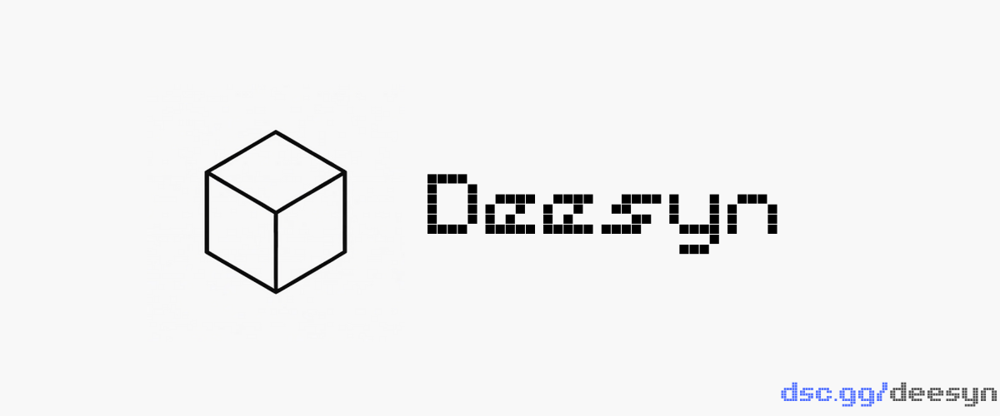

**DeeSyn Module Loader** is a core component of **DeeSyn** that automatically discovers and loads modules at runtime. By leveraging a **dynamic import** system, it eliminates the need for static imports during bot startup, resulting in faster initialization, improved performance, and a flexible, scalable module architecture.

---


> [!NOTE]
> English is not my native language, so some comments and Markdown files were originally written in my native language and then translated with the help of AI. There may be some grammatical mistakes or awkward wording. I appreciate your understanding.

---

# Installation

Clone the repository and navigate into the project directory.

```bash
git clone https://github.com/Notkenftr/DeeSyn-ModuleLoader.git
cd DeeSyn-ModuleLoader
```

Install the required dependencies.

```bash
pip install -r requirements.txt
```

Or using `uv`:

```bash 
uv pip install -r requirements.txt
```

---

# Configuration

Before running the project, open the `.env` file and configure the required environment variables.

```env
TOKEN=your_discord_bot_token
```

| Variable | Description |
| -------- | ----------- |
| `TOKEN` | Your Discord bot token. |

> **Warning**
>
> Never commit your `.env` file or expose your bot token publicly.

---

# Running

Using Python:

```bash
python start.py
```

Or using `uv`:

```bash
uv run start.py
```

---

# Creating a Module

Creating a module only requires a few simple steps.

## 1. Create a module directory

Inside the `modules/` directory, create a new folder for your module.

Example:

```
modules/
└── example/
```

Inside that folder, create an `entry_point.py` file.

```
modules/
└── example/
    └── entry_point.py
```

---

## 2. Create the main class

By default, the loader expects the main class name to match the folder name, with the first letter capitalized.

For example:

```
modules/
└── example/
    ├── metadata.json
    └── entry_point.py
```

The main class should be:

```python
class Example(commands.Cog):
    ...
```

### Using a custom class name

If you prefer a different class name, define a `CONFIG` dictionary at the top of `entry_point.py`.

```python
CONFIG = {
    "main_class": "MutePolling"
}
```

Example:

```python
import discord
import discord.app_commands as ac
from discord.ext import commands

CONFIG = {
    "main_class": "MutePolling"
}

class MutePolling(commands.Cog):
    def __init__(self, bot: commands.AutoShardedBot):
        self.bot = bot
```

---

## 3. Implement the constructor

Your module class **must** implement an `__init__()` method that accepts either a `commands.Bot` or `commands.AutoShardedBot` instance.

Example:

```python
class Example(commands.Cog):
    def __init__(self, bot: commands.AutoShardedBot):
        self.bot = bot
```

---

## 4. Register commands

Once your module has been created, you can register slash commands, listeners, tasks, or anything else exactly as you would in a normal Discord.py cog.

Example:

```python
import discord
from discord import app_commands
from discord.ext import commands

class Example(commands.Cog):
    def __init__(self, bot: commands.AutoShardedBot):
        self.bot = bot

    @app_commands.command(
        name="example",
        description="Example command"
    )
    async def example(self, interaction: discord.Interaction):
        await interaction.response.defer(thinking=True)
        await interaction.followup.send("example")
```

---

## That's it!

Once your module is placed inside the `modules/` directory, **DeeSyn Module Loader** will automatically:

- Discover your module
- Import it dynamically
- Instantiate the main class
- Register commands
- Synchronize application commands when needed

No additional registration or manual loading is required.

## Documentation

Looking for more features?

Explore the documentation in the [`./docs`](./docs) directory for detailed guides, API references, and additional examples.
## Star History

<a href="https://www.star-history.com/?repos=Notkenftr%2FDeeSyn-ModuleLoader&type=date&legend=top-left">
 <picture>
   <source media="(prefers-color-scheme: dark)" srcset="https://api.star-history.com/chart?repos=Notkenftr/DeeSyn-ModuleLoader&type=date&theme=dark&legend=top-left&sealed_token=M96nC3Zoqm4zU7D7AlIwzw9jgFcv66mHpts_JADfQnAifEf8VKqfkn3j4VTQi3uDsrrPhYg_nHrnxycjQ22MVGTKwarJ1Fgj9nf2wyAuhk8UAw5GJBl2SyjQd9bow9LeIIGUjTDiOWtfeWleYuQyvh3tBqhHx1RVRbiJrkjO6Nztqo-6df_wSxpWok5w" />
   <source media="(prefers-color-scheme: light)" srcset="https://api.star-history.com/chart?repos=Notkenftr/DeeSyn-ModuleLoader&type=date&legend=top-left&sealed_token=M96nC3Zoqm4zU7D7AlIwzw9jgFcv66mHpts_JADfQnAifEf8VKqfkn3j4VTQi3uDsrrPhYg_nHrnxycjQ22MVGTKwarJ1Fgj9nf2wyAuhk8UAw5GJBl2SyjQd9bow9LeIIGUjTDiOWtfeWleYuQyvh3tBqhHx1RVRbiJrkjO6Nztqo-6df_wSxpWok5w" />
   
 </picture>
</a>

